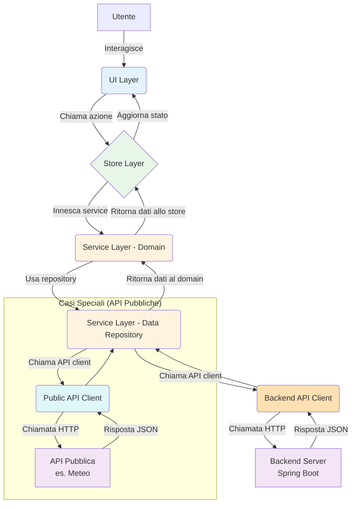

# Architettura Definitiva del Client: Guida Dettagliata

Questo documento formalizza l'architettura software per il client React Native. L'obiettivo è creare una codebase pulita, scalabile e manutenibile, ottimizzata per un'applicazione **server-dependent** che interagisce con un backend principale (Spring Boot) e API pubbliche secondarie.

## 1. Principi Architetturali Chiave

- **Separazione dei Concetti (SoC)**: Ogni layer ha una responsabilità unica. La UI non conosce la logica di business, e la logica di business non conosce i dettagli delle API.
- **Flusso Unidirezionale dei Dati**: I dati si muovono in un'unica direzione (Service → Store → UI), rendendo l'app prevedibile e facile da debuggare.
- **Inversione delle Dipendenze (DIP)**: I moduli di alto livello (logica di business) non dipendono da quelli di basso livello (chiamate API), ma da astrazioni (interfacce).

## 2. Flusso dei Dati Dettagliato

L'applicazione è prevalentemente dipendente dal backend. Il flusso per le operazioni principali sarà il seguente:



---

## 3. Struttura delle Cartelle

La struttura è basata su una cartella `src` alla radice per separare il codice applicativo dalla configurazione.

```
/src
|
|---/app/             # UI Layer: Schermate e Navigazione (Expo Router)
|
|---/ui/
|   |---/components/  # UI Layer: Componenti "stupidi" e riutilizzabili
|   |---/hooks/       # UI Layer: Hooks per logica locale della UI (es. animazioni)
|
|---/store/           # Store Layer: Stato globale (Zustand)
|   |---/userStore.ts
|
|---/services/        # Service Layer: Il "cervello" dell'applicazione
|   |
|   |---/domain/      # CUORE: Logica e regole di business
|   |   |---/entities/
|   |   |---/repositories/ # Interfacce (Contratti)
|   |
|   |---/data/        # IMPLEMENTAZIONE: Come i dati vengono gestiti
|       |---/repositories/ # Implementazione dei contratti
|       |---/api/          # Client HTTP e gestione delle diverse fonti API
|       |---/mappers/      # Trasformazione Dati (DTO -> Entity)
|       |---/dto/          # Oggetti che rispecchiano le risposte JSON delle API
|
|---/constants/       # Costanti, temi, colori
|---/utils/           # Funzioni di utilità
```

---

## 4. Dettaglio dei Layer e Responsabilità

### 🧩 UI Layer (`/app` e `/ui`)
- **Responsabilità**: Renderizzare l'interfaccia e catturare gli input dell'utente. Non contiene alcuna logica di business.
- **/app/**: Gestisce il routing tramite Expo Router. Le pagine (es. `login.tsx`) sono responsabili di:
    1.  Mostrare i componenti UI.
    2.  Leggere dati dallo **Store Layer**.
    3.  Invocare azioni definite nello **Store Layer** in risposta agli eventi utente (es. `onPress`).
- **/ui/components/**: Componenti puri che ricevono dati e callback solo tramite `props`. Esempi: `Button`, `Card`, `TextInput`.
- **/ui/hooks/**: Hooks per logica strettamente confinata alla UI, senza impatti globali. Esempio: `useFormState` per gestire lo stato di un form complesso prima del submit.

### 🧠 Store Layer (`/store`)
- **Responsabilità**: Essere l'unica fonte di verità per la UI. Centralizza lo stato dell'applicazione, rendendolo accessibile e reattivo.
- **Tecnologia**: **Zustand**.
- **Funzionamento**:
    1.  **Espone Azioni (Triggers)**: Fornisce funzioni che la UI può chiamare (es. `loginUser`, `fetchProperties`). Queste azioni sono semplici "trigger" che non contengono logica complessa.
    2.  **Invoca i Servizi**: Le azioni invocano i metodi del **Service Layer**, che è il vero responsabile dell'orchestrazione e della logica di business.
    3.  **Gestisce lo Stato**: In base al risultato (successo o errore) restituito dal Service Layer, lo store aggiorna il proprio stato (`isLoading`, `data`, `error`), notificando la UI di conseguenza.
    4.  **Notifica la UI**: I componenti UI che usano lo store si aggiornano automaticamente.

### ⚙️ Service Layer (`/services`)
- **Responsabilità**: Incapsulare tutta la logica di business e la comunicazione con le API.

#### `/domain` (Il "Cosa")
- **Scopo**: Definire le regole di business dell'applicazione, in modo agnostico da qualsiasi tecnologia. È il nucleo stabile dell'app.
- **/entities/**: Classi o interfacce che modellano i concetti di business (es. `User`, `Property`). Contengono solo dati e logica intrinseca (es. un metodo `user.isMinor()`).
- **/repositories/**: **Contratti** (interfacce) che definiscono le operazioni di dati necessarie al business. Esempio: `interface IUserRepository { getUserById(id: string): Promise<User>; }`. Non sanno come i dati vengono recuperati.

#### `/data` (Il "Come")
- **Scopo**: Implementare i contratti del `domain` e gestire i dettagli tecnici dell'accesso ai dati.
- **/api/**: Gestisce la comunicazione con tutte le fonti di dati esterne.
    -   `backendApiClient.ts`: Istanza `axios` pre-configurata per il **backend Spring Boot**. È il punto di contatto per tutte le operazioni di business critiche. Deve includere:
        -   Interceptor per l'autenticazione (aggiunta token JWT e gestione refresh).
        -   Interceptor per la standardizzazione degli errori HTTP.
    -   `publicApiClients.ts`: Esporta istanze `axios` separate per ogni API pubblica di terze parti (es. `weatherApiClient`, `photonApiClient`). Ogni istanza avrà la sua `baseURL` e, se necessaria, la sua gestione della chiave API.
- **/repositories/**: Implementa le interfacce del `domain`. È l'orchestratore.
    -   Esempio: `UserRepository.ts` implementa `IUserRepository`. Il suo metodo `getUserById` chiama `backendApiClient.get(...)`, riceve un `UserDTO`, lo passa a un `UserMapper` e restituisce un'entità `User` al chiamante (lo store).
- **/mappers/**: Funzioni pure che convertono oggetti `DTO` (dalle API) in `Entities` (del dominio) e viceversa.
- **/dto/**: Interfacce TypeScript che definiscono la struttura del JSON ricevuto dalle API.

---

Questo modello dettagliato ci fornisce una guida chiara per costruire un'applicazione robusta, manutenibile e pronta a scalare.

---

## 5. Decisioni Architetturali Aggiuntive

### 5.1. Strategia di Comunicazione API: Approccio Ibrido

L'applicazione adotta un approccio ibrido per bilanciare sicurezza, performance e manutenibilità.

-   **Regola Principale (Backend-as-a-Proxy)**: Tutte le operazioni che coinvolgono logica di business, dati sensibili o che richiedono autenticazione devono passare attraverso il **backend Spring Boot**. Questo garantisce che le API key e la logica complessa rimangano lato server.

-   **Eccezione (Chiamate Dirette)**: Le chiamate dirette dal client a API pubbliche di terze parti (es. meteo, autocomplete indirizzi) sono permesse e incoraggiate quando:
    1.  L'API è pubblica e utilizza chiavi gratuite o a basso rischio.
    2.  I dati non sono sensibili.
    3.  La riduzione della latenza è un vantaggio significativo per l'esperienza utente.
    Queste chiamate vengono gestite da client dedicati in `/data/api/publicApi/`.

### 5.2. Gestione degli Errori End-to-End

Una gestione degli errori coerente è fondamentale.

1.  **API Client Layer (`/data/api`)**: Gli interceptor dei client `axios` catturano errori di rete e risposte con `status >= 400`, lanciando eccezioni personalizzate e tipizzate (es. `NetworkError`, `AuthenticationError`, `InvalidDataError`).
2.  **Repository Layer (`/data/repositories`)**: Cattura queste eccezioni e le propaga in modo controllato.
3.  **Store Layer (`/store`)**: Le azioni che eseguono chiamate asincrone sono avvolte in `try...catch`. Lo store aggiorna il suo stato per riflettere l'esito:
    -   `try`: Imposta `isLoading = true`.
    -   `catch`: Imposta lo stato di errore (`error = 'messaggio per utente'`) e resetta `isLoading = false`.
    -   `finally`: Si assicura che `isLoading` sia `false` al termine dell'operazione.
4.  **UI Layer (`/app`, `/ui`)**: I componenti reagiscono ai cambiamenti di `isLoading` e `error` per mostrare feedback adeguato (es. `ActivityIndicator`, `Toast`, messaggi di errore).

### 5.3. Sicurezza e Gestione dei Dati Sensibili

-   **Token di Autenticazione**: I token (JWT, refresh token) devono essere salvati **esclusivamente** tramite `expo-secure-store`. L'uso di `AsyncStorage` per questi dati è vietato.
-   **API Key Pubbliche**: Le chiavi per API pubbliche usate sul client devono essere gestite tramite variabili d'ambiente (`.env`) e caricate in modo sicuro.

### 5.4. Considerazioni Future: Caching e Offline Support

Per migliorare le performance e la resilienza, si raccomanda di introdurre una strategia di caching.

-   **Proposta**: Implementare un meccanismo di caching all'interno dei **Repository** (`/data/repositories`).
-   **Strategia Consigliata**: *Stale-while-revalidate*. Il repository restituisce immediatamente i dati dalla cache (se disponibili) e avvia una richiesta di aggiornamento in background. Questo rende la UI istantaneamente reattiva e garantisce che i dati vengano aggiornati.