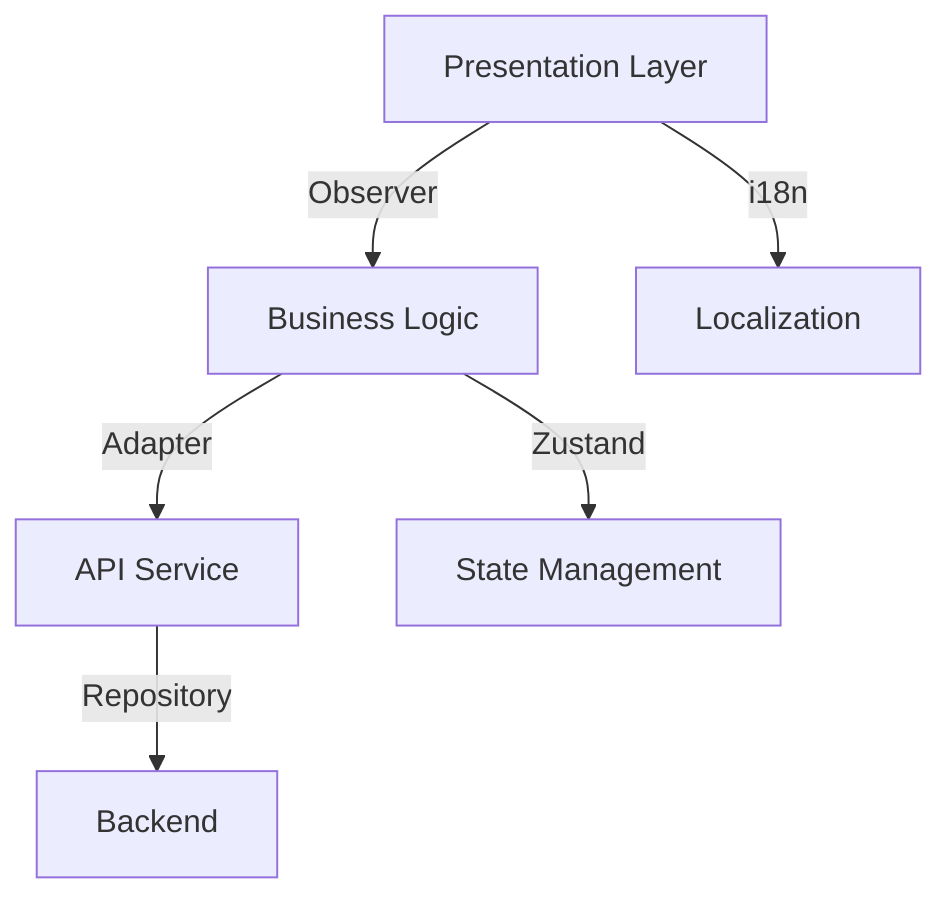

# Property Dashboard Integration Plan

## 1. Architecture Patterns


## 2. Key Implementation Details
### 2.1 Component Refactoring (SOLID Principles)
**ThemedButton Extension:**
```typescript
// Components/ThemedButton.tsx
interface ThemedButtonProps extends TouchableOpacityProps {
  icon?: keyof typeof Icons; // Enforce icon consistency
  variant?: 'primary'|'secondary'|'success';
  loading?: boolean;
  accessibilityRole?: 'button'|'link';
}

// Usage with Type Safety
<ThemedButton 
  variant="success" 
  icon="Export" 
  accessibilityRole="button"
/>
```

**StatCard Optimization:**
```typescript
// Components/PropertyDashboard/StatCard.tsx
interface StatCardProps {
  metric: keyof DashboardStats;
  delta?: number;
  loading?: boolean;
}
```

### 2.2 API Integration (Repository Pattern)
```typescript
// app/_services/api.service.ts
static get endpoints() {
  return {
    propertyStats: `${BASE}/agent/properties/stats?timeRange=${timeRange}`,
    propertyDetails: `${BASE}/agent/properties/details`
  }
}

// Zustand Store Integration
const usePropertyStore = create<PropertyState>(set => ({
  stats: null,
  fetchStats: async (timeRange) => {
    const endpoint = ApiService.endpoints.propertyStats(timeRange);
    const response = await fetch(endpoint);
    set({ stats: await response.json() });
  }
}));
```

### 2.3 Localization Strategy
```json
// app/_utils/locales/en.json
{
  "dashboard": {
    "exportTable": "Export Report",
    "metrics": {
      "totalProperties": "Total Properties",
      "soldProperties": "Properties Sold"
    }
  }
}

// Usage with nested keys
t('dashboard.metrics.totalProperties')
```

## 3. Testing Strategy
```typescript
// __tests__/PropertyDashboard.test.tsx
test('renders loading state', () => {
  mockApiResponse(500);
  render(<PropertyDashboard />);
  expect(screen.getByTestId('skeleton-loader')).toBeTruthy();
});

test('shows error state', async () => {
  mockApiError();
  render(<PropertyDashboard />);
  await waitFor(() => 
    expect(screen.getByText(/error_fetching_data/i)).toBeTruthy()
  );
});
```

## 4. Error Handling (Adapter Pattern)
```typescript
// ErrorAdapter.ts
class APIErrorAdapter implements ErrorHandler {
  handle(error: unknown): UserFriendlyError {
    return {
      code: this.mapErrorCode(error.code),
      message: this.translateMessage(error.message)
    };
  }
  
  private mapErrorCode(code: number): string {
    return errorCodeMap[code] || 'UNKNOWN_ERROR';
  }
}
```

## 5. Implementation Roadmap
1. Component unification (2h)
2. API service integration (3h)
3. Localization updates (1h)
4. State management setup (2h)
5. Error handling layer (2h)
6. E2E testing (2h)

**Best Practices Compliance:**
- DRY: Reuse existing UI components
- KISS: Avoid over-engineering data flow
- YAGNI: Implement only required metrics
- SOC: Separate data fetching from presentation

## 6. Performance Considerations
- Implement virtualized lists for large datasets
- Add memoization to dashboard components
- Use CDN caching for static assets
- Configure compression for API responses

## 7. Component Updates
### 7.1 RoleCard Integration
Instead of creating a new ExportButton component, we've adapted the existing RoleCard:

```typescript
// Using RoleCard for export functionality
<RoleCard
  title={t("exportTable")}
  onSelect={exportToPDF}
  accessibilityLabel={t("exportTable")}
  compact={true}
  iconUrl="export"
  lightColor="#22C55E"
  className="min-w-[120px]"
/>
```

**Benefits:**
- Reuses existing component (DRY principle)
- Maintains haptic feedback functionality
- Consistent with app's design language
- Leverages existing accessibility features

### 7.2 Localization Updates
Added new translations to support the dashboard features:
```json
// app/_utils/locales/en.json
{
  "exportTable": "Export Table",
  "propertyOverview": "Property Overview",
  "totalProperties": "Total Properties",
  // ... other translations
}
```

File saved at: FrontEndTS/DietiEstates/components/PropertyDashboard/IntegrationPlan.md
