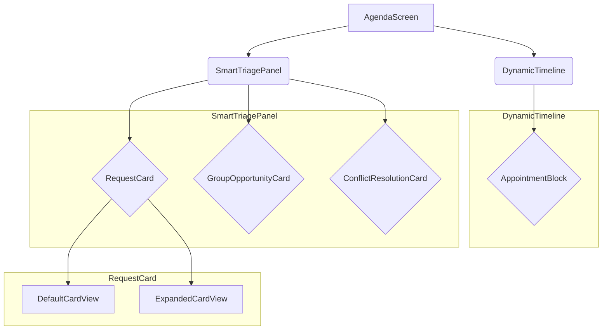

# Piano di Implementazione Tecnica: Agenda Interattiva dell'Agente

Questo documento descrive l'architettura tecnica per la funzionalità "Agenda Interattiva dell'Agente" in un'applicazione React Native con TypeScript.

## 1. Struttura dei Componenti

La funzionalità sarà suddivisa in componenti riutilizzabili e ben definiti.



---

### Componenti Principali

#### `AgendaScreen`
-   **Descrizione:** Componente di livello superiore che funge da contenitore per l'intera schermata dell'agenda.
-   **Props:**
    -   `userId: string` - ID dell'agente corrente.
-   **Stato Interno:**
    -   `isTriagePanelVisible: boolean` - Controlla la visibilità del pannello "Smart Triage".
    -   `appointments: Appointment[]` - Lista degli appuntamenti confermati.
    -   `visitRequests: VisitRequest[]` - Lista delle richieste di visita in sospeso.
    -   `selectedDate: Date` - La data attualmente visualizzata nella timeline.

#### `DynamicTimeline`
-   **Descrizione:** Visualizza la griglia temporale con gli appuntamenti confermati.
-   **Props:**
    -   `appointments: Appointment[]` - Appuntamenti da visualizzare.
    -   `currentDate: Date` - La data da mostrare.
    -   `onSelectAppointment: (appointmentId: string) => void` - Callback per quando un appuntamento viene selezionato.
-   **Stato Interno:**
    -   `timelineLayout: object` - Calcoli per il posizionamento degli eventi sulla griglia (es. ora di inizio, durata).

#### `AppointmentBlock`
-   **Descrizione:** Rappresenta un singolo blocco di appuntamento nella timeline.
-   **Props:**
    -   `appointment: Appointment` - I dati dell'appuntamento.
    -   `isConflicting: boolean` - (Opzionale) Indica se l'appuntamento è in conflitto.
    -   `isGroup: boolean` - (Opzionale) Indica se è un'opportunità di gruppo.
    -   `onPress: () => void` - Azione al tocco.
-   **Stato Interno:** Nessuno.

#### `SmartTriagePanel`
-   **Descrizione:** Pannello a comparsa (bottom sheet) che mostra le richieste di visita in sospeso.
-   **Props:**
    -   `isVisible: boolean` - Controlla se il pannello è visibile.
    -   `requests: VisitRequest[]` - Le richieste da mostrare.
    -   `onClose: () => void` - Funzione per chiudere il pannello.
    -   `onConfirmRequest: (requestId: string) => void` - Gestore per la conferma.
    -   `onDeclineRequest: (requestId: string) => void` - Gestore per il rifiuto.
-   **Stato Interno:**
    -   `activeFilter: 'all' | 'conflicts' | 'groups'` - Filtro per le richieste.

#### `RequestCard`
-   **Descrizione:** Card interattiva per una singola richiesta di visita. Gestisce lo swipe per azioni rapide.
-   **Props:**
    -   `request: VisitRequest` - I dati della richiesta.
    -   `onConfirm: () => void` - Azione di conferma.
    -   `onDecline: () => void` - Azione di rifiuto.
-   **Stato Interno:**
    -   `isExpanded: boolean` - Controlla la vista compatta/espansa.

## 2. Modelli di Dati (TypeScript)

Definiamo le interfacce per i principali oggetti di dati.

```typescript
// Stato di una richiesta o appuntamento
type Status = 'pending' | 'confirmed' | 'declined' | 'conflicting';

// Tipo di appuntamento per la colorazione
type AppointmentType = 'standard' | 'group' | 'conflict';

interface User {
  id: string;
  name: string;
  avatarUrl?: string;
}

interface Property {
  id: string;
  address: string;
  imageUrl?: string;
}

interface Appointment {
  id: string;
  property: Property;
  client: User;
  startTime: Date;
  endTime: Date;
  durationMinutes: number;
  type: AppointmentType;
  notes?: string;
}

interface VisitRequest {
  id: string;
  property: Property;
  potentialClients: User[];
  requestedTime: Date;
  status: Status;
  isGroupOpportunity?: boolean;
  conflict?: Conflict;
}

interface Conflict {
  conflictingAppointmentId: string;
  reason: string; // Es. "Orario sovrapposto"
}
```

## 3. Strategia di Gestione dello Stato

Proponiamo un approccio ibrido utilizzando `useState` e `useReducer` a livello del componente `AgendaScreen` per centralizzare la logica di business.

-   **Dati Principali:**
    -   `appointments: Appointment[]` e `visitRequests: VisitRequest[]` saranno gestiti da un `useReducer` per centralizzare le azioni di aggiunta, rimozione e aggiornamento. Questo semplifica la gestione delle transizioni di stato (es. da richiesta a appuntamento confermato).
    -   L'hook `useReducer` accetterà azioni come `CONFIRM_REQUEST`, `DECLINE_REQUEST`, `ADD_APPOINTMENT`.

-   **Stato della UI:**
    -   Lo stato locale della UI (es. `isTriagePanelVisible`, `isExpanded` in `RequestCard`) sarà gestito con `useState` all'interno dei componenti pertinenti per mantenere l'incapsulamento e ridurre re-render non necessari a livello globale.

#### Esempio di Reducer

```typescript
type AgendaAction =
  | { type: 'LOAD_DATA'; payload: { appointments: Appointment[]; requests: VisitRequest[] } }
  | { type: 'CONFIRM_REQUEST'; payload: { requestId: string } }
  | { type: 'DECLINE_REQUEST'; payload: { requestId: string } };

function agendaReducer(state: AgendaState, action: AgendaAction): AgendaState {
  switch (action.type) {
    case 'CONFIRM_REQUEST':
      // Logica per spostare una richiesta a un appuntamento
      return { ...state, /* ... */ };
    case 'DECLINE_REQUEST':
      // Logica per rimuovere una richiesta
      return { ...state, /* ... */ };
    default:
      return state;
  }
}
```

## 4. Flusso di Interazione

#### Aprire/Chiudere il "Smart Triage"
1.  **Utente:** Tocca l'icona dell'inbox.
2.  **Sistema:** `AgendaScreen` imposta `isTriagePanelVisible` a `true`.
3.  **UI:** Il `SmartTriagePanel` viene visualizzato con un'animazione dal basso.

#### Espandere/Comprimere una `RequestCard`
1.  **Utente:** Tocca una `RequestCard`.
2.  **Sistema:** La `RequestCard` aggiorna il suo stato interno `isExpanded` a `!isExpanded`.
3.  **UI:** La card si anima per mostrare/nascondere i dettagli aggiuntivi.

#### Confermare/Rifiutare una Richiesta
-   **Via Tap:**
    1.  L'utente tocca i pulsanti "Conferma" o "Rifiuta" nella `RequestCard`.
    2.  Viene invocata la callback `onConfirm` o `onDecline`.
    3.  `AgendaScreen` invia un'azione al suo `reducer`.
-   **Via Swipe:**
    1.  L'utente esegue uno swipe su una `RequestCard`.
    2.  La libreria di gesture (es. `React Native Gesture Handler`) rileva il gesto.
    3.  Al completamento dello swipe, viene chiamata la funzione di conferma/rifiuto.

#### Gestire un "Group Opportunity"
1.  Una `GroupOpportunityCard` viene visualizzata nel "Smart Triage".
2.  L'utente può confermare l'intero gruppo, creando un singolo `Appointment` di tipo `group` con più clienti associati.

#### Gestire i Conflitti
1.  Se una richiesta è in conflitto, la `RequestCard` mostra un indicatore di errore.
2.  Al tocco, si entra in una "Modalità Risoluzione" dove l'utente può:
    -   Riprogrammare l'appuntamento in conflitto.
    -   Rifiutare la nuova richiesta.
    -   Contattare i clienti coinvolti.